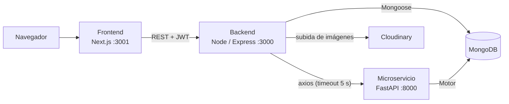

# One Piece App

Aplicación web temática de One Piece y deportes, hecha para practicar MongoDB/JSON y una arquitectura de varios servicios. Permite ver, crear, editar y borrar personajes y atletas (con foto), iniciar sesión y consultar estadísticas calculadas por un microservicio en Python.

Hecha por Jhon Fredy Osuna Herrera (aprendiz SENA, Análisis y Desarrollo de Software).

## Arquitectura

El proyecto son tres servicios que comparten la misma base de datos MongoDB. El frontend solo habla con el backend de Node; es Node quien llama al microservicio de Python.



| Servicio | Carpeta | Tecnología | Puerto |
|---|---|---|---|
| Frontend | `onepiece-frontend` | Next.js 16, React 19, Tailwind 4 | 3001 |
| Backend | `onepiece-app` | Node.js, Express 5, Mongoose 9, JWT, Multer | 3000 |
| Microservicio de estadísticas | `onepiece-estadisticas` | Python, FastAPI, Motor, Pydantic | 8000 |

## Qué incluye

- CRUD completo de **personajes** y **atletas** (arquitectura MVC: `models/`, `controllers/`, `routes/`).
- **Autenticación con JWT**: registro, login y completar perfil para usuarios antiguos sin `username`. Las lecturas (GET) son públicas; crear, editar y borrar requieren sesión.
- **Subida de imágenes a Cloudinary**: solo JPEG, PNG y WebP de hasta 5 MB. El servidor responde 415 si el tipo no es válido y 413 si pesa demasiado. Al cambiar o borrar un registro, la imagen anterior se elimina de Cloudinary (se guarda su `imagenPublicId`).
- **Estadísticas** con una aggregation pipeline de MongoDB en el microservicio. El backend expone `GET /estadisticas/resumen`, que llama al microservicio y reenvía la respuesta (502 si el microservicio no responde).
- Frontend con sesión real, menú lateral que cambia según la sesión, modal de confirmación de borrado y validación de la imagen antes de enviarla.

## Requisitos

- Node.js 20.9 o superior
- Python 3.12
- MongoDB (por ejemplo, en Docker)
- Una cuenta de Cloudinary (plan gratuito)

## Configuración

Cada servicio lee sus variables de un archivo `.env` (nunca se sube al repositorio). Copia `.env.example` a `.env` y completa los valores.

**Backend (`onepiece-app/.env`)**

```
MONGODB_URI=mongodb://localhost:27017/<nombre-de-la-base>
PORT=3000
JWT_SECRET=<una-cadena-larga-y-secreta>
CLOUDINARY_CLOUD_NAME=<tu-cloud-name>
CLOUDINARY_API_KEY=<tu-api-key>
CLOUDINARY_API_SECRET=<tu-api-secret>
```

**Microservicio (`onepiece-estadisticas/.env`)**

```
MONGODB_URI=mongodb://localhost:27017/<nombre-de-la-base>
```

Debe apuntar a la **misma base de datos** que el backend.

El frontend no necesita variables de entorno; espera el backend en `http://localhost:3000`.

## Cómo correrlo

Levántalos en este orden, cada uno en su propia terminal.

**1. MongoDB**

Si ya tienes un contenedor de MongoDB, solo enciéndelo. Si no, un ejemplo:

```
docker run -d --name onepiece-mongo -p 27017:27017 mongo
```

**2. Microservicio de estadísticas**

```
cd onepiece-estadisticas
python -m venv venv
venv\Scripts\activate
pip install -r requirements.txt
uvicorn main:app --reload --port 8000
```

La documentación automática queda en http://localhost:8000/docs.

**3. Backend**

```
cd onepiece-app
npm install
npm run dev
```

Datos de ejemplo (opcional): `npm run seed` carga personajes y `node scripts/seedAtletas.js` carga atletas.

**4. Frontend**

```
cd onepiece-frontend
npm install
npm run dev
```

Abre http://localhost:3001.

## Tests

| Servicio | Comando | Resultado actual |
|---|---|---|
| Backend | `npm test` | 11 suites, 72 tests |
| Microservicio | `pytest -v` | 6 tests |

- **Backend (Jest + Supertest):** modelos, middleware JWT, rutas protegidas, autenticación, subida de imágenes (con Cloudinary simulado), borrado de imágenes viejas y el controlador de estadísticas (con axios simulado, incluyendo los casos de error 502). Usan la MongoDB local.
- **Microservicio (pytest + httpx):** los endpoints se prueban contra una base de datos de prueba llamada `onepiece_test`, que se crea y se borra sola en cada test. Tu base real no se toca.

## API principal

**Backend (Node, puerto 3000)**

| Método | Ruta | Descripción | Requiere sesión |
|---|---|---|---|
| POST | `/auth/registro` | Crear cuenta | No |
| POST | `/auth/login` | Iniciar sesión (devuelve el token JWT) | No |
| PATCH | `/auth/completar-perfil` | Completar `username` en usuarios antiguos | Sí |
| GET | `/personajes`, `/atletas` | Listar y ver detalle | No |
| POST / PUT / DELETE | `/personajes`, `/atletas` | Crear, editar y borrar (foto en el campo `imagen`, multipart) | Sí |
| GET | `/estadisticas/resumen` | Resumen calculado por el microservicio | No |

Las rutas protegidas usan el encabezado `Authorization: Bearer <token>`.

**Microservicio (FastAPI, puerto 8000)**

| Método | Ruta | Descripción |
|---|---|---|
| GET | `/estadisticas/personajes` | Total de personajes y el de mayor recompensa |
| GET | `/estadisticas/atletas` | Total de atletas y conteo por equipo |
| GET | `/estadisticas/resumen` | Resumen general |

Si no hay personajes, `personaje_mayor_recompensa` llega como `null`.

## Decisiones de diseño

- `app.js` está separado de `index.js` para poder probar la API con Supertest sin levantar el servidor.
- Se guarda `imagenPublicId` junto a la URL de cada imagen para poder borrarla de Cloudinary sin adivinar su identificador.
- El frontend valida la imagen (tipo y tamaño) y el servidor la vuelve a validar, porque la validación del cliente se puede saltar.
- Las respuestas del microservicio están tipadas con modelos Pydantic, que además generan la documentación en `/docs`.
- El script `scripts/migrarImagenes.js` (modo ensayo por defecto, `--aplicar` para ejecutar) subió el catálogo original a Cloudinary.

## Estructura

```
onepiece-app/            backend (Node)
  config/  controllers/  middleware/  models/  routes/  scripts/  tests/  utils/
onepiece-estadisticas/   microservicio (Python)
  main.py  tests/  pytest.ini  requirements.txt
onepiece-frontend/       frontend (Next.js)
  src/app/  src/components/  src/hooks/  public/
```